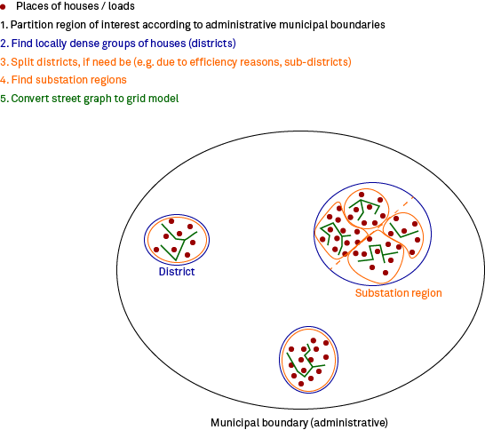
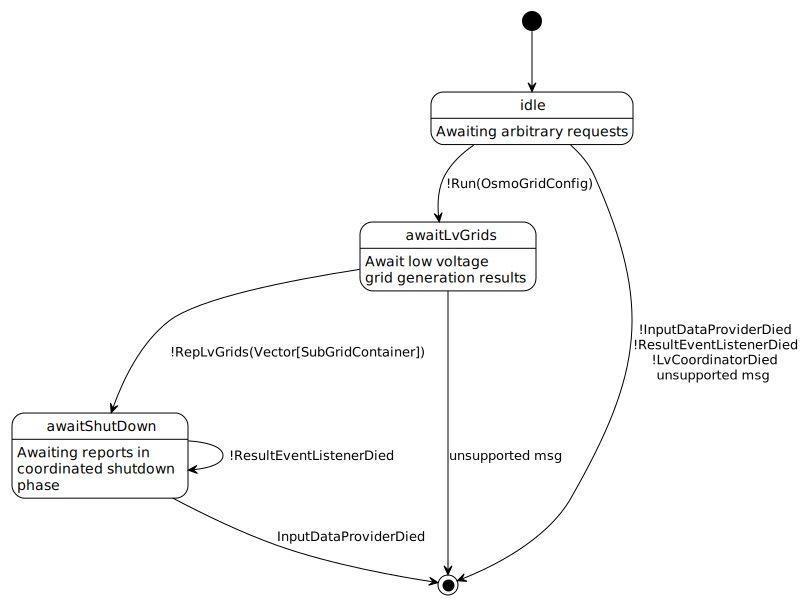

# Concept

... of OSMoGrid and it's implementation.
Here, we want to focus on the overall structure of the tool and which part does serve which purpose.

The computational heaviest part is connecting households / loads to the street graph as well as clustering the loads based on the distances following the street graph.
This is why we want to shift those parts to the smallest regions possible.
To achieve this, a given region of interest is partitioned heuristically as much as possible.
The concept is as follows:

The region of interest is broken down according to the administrative boundaries until the level of municipality boundaries is reached.
Moreover, these municipal boundaries are further broken down to districts.
They are defined as local dense groups of houses, that do form disjoint groups.
However, if those dense groups are very big, computational complexity still can be too big.
So, if need be, the districts are further broken down into smaller sub-districts.
Based on those (sub-)districts, cluster of loads are build, that later form the regions of secondary substations.
Those clusters respect the distance between them according to the street graph, they are connected to.
Lastly, the street graph is converted into a grid model.

Following this concept, the following actor hierarchy is implemented:

## Actors
### OsmoGridGuardian
- Coordination of multi voltage level spanning routine
- Error handling
- Collection of lv grids received from `LvCoordinator` and assigning subnet numbers

#### Finite state representation

### InputDataProvider
- Connects to OpenStreeMap (either via pbf file or API)
- Acquires needed data and filters it (on request and dependent on the purpose)

### LvCoordinator
- Coordinates the generation of the whole low voltage level
- Determines the highest available administrative boundary within the region of interest
- Spawns an `LvRegionCoordinator` to split up the region of interest according to this administrative level
- Collects results and checks completeness
- *Outcome*: Complete region of interest + the highest available administrative boundary

### LvRegionCoordinator
- Splits up the region of interest according to a given administrative boundary
- If the level of a municipality is **NOT** reached:
  - Spawns new `LvRegionCoordinator`s per new subregion to split up for the next lower administrative boundary
  - *Outcome*: Subregions on administrative level `n` + the next lowest administrative level `n-1` 
- If the level of a municipality is reached:
  - Hand over the "municipalities" to `MunicipalityCoordinator`s
  - *Outcome*: Subregions on administrative level "municipality"

### MunicipalityCoordinator
- Coordinates the region partitioning within the administrative boundary of a municipality
- Determines dense and disjoint groups of houses as local "districts"
- *Outcome*: Districts within the given municipality

### DistrictCoordinator
- Breaks down districts even further, if still too big w.r.t. computational measures (to be defined)
- *Outcome*: (Sub)districts with suitable size

### SubDistrictCoordinator
- Responsible for handling a sub-district
- A sub-district can also be a district, if that isn't too big
- Derives loads from houses
- Connects loads to street graph
- Clusters loads while respecting the distance on the street graph
- Those clusters are the regions of secondary substations
- Hands over the graph to `GridGenerator`s
- *Outcome*: Street subgraphs per secondary substation region

### LvGridGenerator
- Generates a distinct, galvanically closed lv sub grid model from street graph
- *Outcome*: Grid model per secondary substation region

### ResultListener
- Persisting overall grid model to sinks
