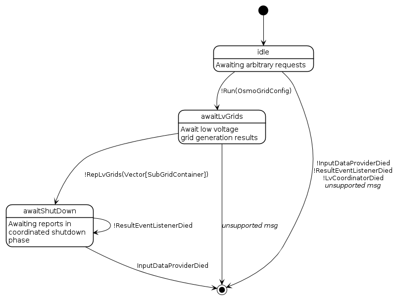

# Concept

... of OSMoGrid and it's implementation.
Here, we want to focus on the overall structure of the tool and which part does serve which purpose.

## Actors
### OsmoGridGuardian
- Coordination of voltage level spanning routine
- Error handling
- Collection of lv grids received from `LvCoordinator` and assigning subnet numbers

#### Finite state representation

### InputDataProvider
- Connects to OpenStreeMap (either via pbf file or API)
- Acquires needed data and filters it (on request and dependent on the purpose)

### LvCoordinator
- Coordinates the generation of the whole low voltage level
- Partitions the OSM data by municipal boundaries
  - Settlements only rarely cross municipality boundaries
  - The concept of concessional agreements on serving a municipality incentive to not let grids cross boundaries
- Spawns a pool of `LvGridGenerator`s
- Spawns a pool of `LvRegionHandler`s (needs to know the `LvGridGenerator` worker pool)
- Hand over regions (here: municipalities) to `LvRegionGenerator`s
- Collect results from `LvRegionGenerator`s and check completeness

### LvRegionalGenerator
- Responsible for generation of lv grids within a defined region (might be a municipality)
- Generate loads in that region
- Cluster them to secondary-substation regions
- Build sub-graphs according to secondary-substation regions and hands them over to `LvGridGenerator`s
- Collect results from `LvGridGenerator`s, check completeness and forward them to `LvCoordinator`

### LvGridGenerator
- Generates a distinct, galvanically closed lv sub grid model
- Building the distance matrix
- Determining perpendiculars and connect loads to the street graph
- Transform into electrical grid model

### ResultListener
- Persisting overall grid model to sinks
