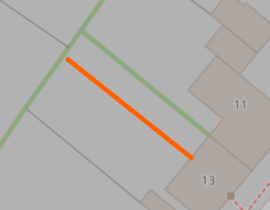
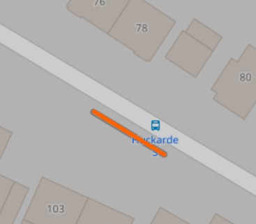

# The intricacies of OSM data

Since OpenStreetMap data is user-generated, there is no guarantee that it follows stringent formatting and defined structures.
In order to still make grid generation work, we hard-coded some things that bypass failures that we encountered.
These are some of them:

## Tiny pieces of unconnected highways

Some small unconnected highways need to be discarded, although buildings might have been assigned to them.

